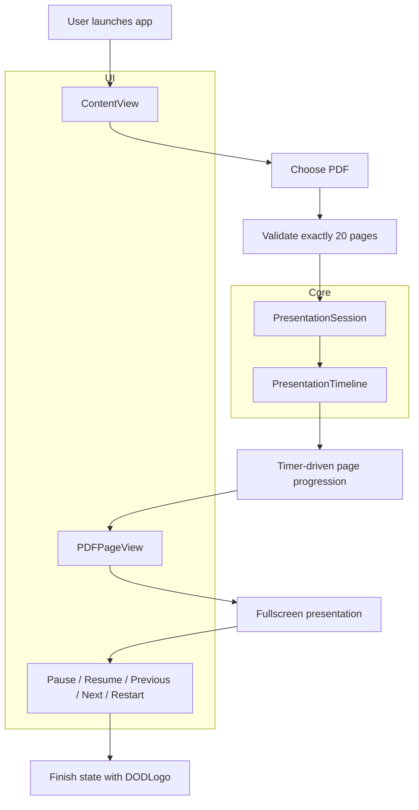

# IgniteTalkPDF

IgniteTalkPDF is a native macOS presentation app built for the Ignite format: a PDF with exactly 20 pages, displayed fullscreen at 15 seconds per page for a total of 5 minutes. After the final page, the DevOpsDays DFW brand logo appears as the closing slide.

## Overview

- Built with SwiftUI and PDFKit
- Targets macOS 13 or newer
- Uses a single fixed presentation timeline: 20 pages × 15 seconds
- Validates page count before starting a presentation
- Supports both Intel and Apple Silicon Macs via a universal binary build
- Includes a dependency-free timing model and test coverage

## Architecture



## Build and run

1. Open [IgniteTalkPDF.xcodeproj](IgniteTalkPDF.xcodeproj) in Xcode 16 or newer.
2. Select the **IgniteTalkPDF** scheme.
3. Choose **My Mac** as the destination.
4. Press **Run** (`⌘R`).

## How it works

- The user selects a PDF file.
- The app validates that it contains exactly 20 pages.
- A `PresentationSession` updates the `PresentationTimeline` based on system uptime.
- The timeline advances 15 seconds per slide and controls pause/resume and navigation.
- The app exits fullscreen with the Escape key and can restart the presentation at any time.

The last-used PDF folder is remembered in `UserDefaults`, so the chooser reopens in the same directory next time.

## Testing

Run the project tests from Xcode with **Product → Test** (`⌘U`).

A dependency-free command-line validation of the same timing logic is also available:

```sh
swift run IgniteTalkCoreChecks
```

## Release build

A release build can be created from Xcode or via CLI:

```sh
xcodebuild -project IgniteTalkPDF.xcodeproj \
  -scheme IgniteTalkPDF \
  -configuration Release \
  -derivedDataPath .build/derivedData \
  CODE_SIGNING_ALLOWED=NO build
```

The generated app bundle is placed under:

```text
.build/derivedData/Build/Products/Release/IgniteTalkPDF.app
```

### First launch on macOS

The GitHub Actions build is unsigned, so macOS may block it the first time it opens:

1. Try to open `IgniteTalkPDF.app`, then click **Done** in the warning.
2. Open **System Settings → Privacy & Security**.
3. In the **Security** section, click **Open Anyway** for IgniteTalkPDF and confirm **Open**.

If **Open Anyway** does not appear, remove the quarantine attribute in Terminal:

```sh
xattr -dr com.apple.quarantine /path/to/IgniteTalkPDF.app
```

Replace `/path/to/IgniteTalkPDF.app` with the app's actual location, then open it again.

## Notes

- The app is intentionally PDF-only.
- It has no third-party runtime dependencies.
- The project is configured to build as a universal binary for Intel and Apple Silicon Macs.

**Author:** Jack Teoh  
**Organization:** DevOpsDays Dallas  
**Created with:** GitHub Copilot
